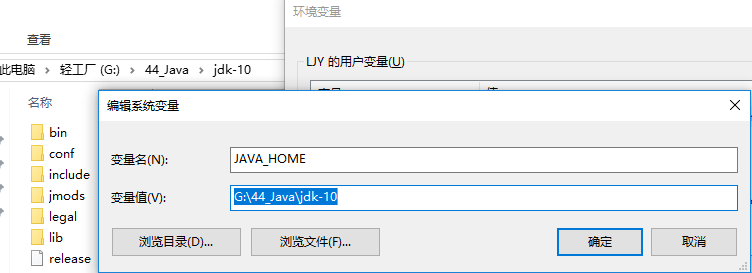
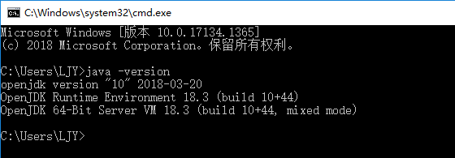

- [基础知识](#%e5%9f%ba%e7%a1%80%e7%9f%a5%e8%af%86)
  - [DOS基本指令](#dos%e5%9f%ba%e6%9c%ac%e6%8c%87%e4%bb%a4)
  - [面向对象](#%e9%9d%a2%e5%90%91%e5%af%b9%e8%b1%a1)
  - [java特性](#java%e7%89%b9%e6%80%a7)
  - [java技术体系平台](#java%e6%8a%80%e6%9c%af%e4%bd%93%e7%b3%bb%e5%b9%b3%e5%8f%b0)
  - [java运行机制及运行过程](#java%e8%bf%90%e8%a1%8c%e6%9c%ba%e5%88%b6%e5%8f%8a%e8%bf%90%e8%a1%8c%e8%bf%87%e7%a8%8b)
    - [特点](#%e7%89%b9%e7%82%b9)
    - [核心机制](#%e6%a0%b8%e5%bf%83%e6%9c%ba%e5%88%b6)
  - [环境搭建](#%e7%8e%af%e5%a2%83%e6%90%ad%e5%bb%ba)
  - [jdk,jre](#jdkjre)

# 基础知识
## DOS基本指令
- 进入某个盘符，可以直接```d:```
- 列举文件夹中内容：```dir```
- 创建文件夹：```md 目录名```
- 删除文件夹：```rd 目录名```
- 删除文件：```del 文件名```
- 进入指定目录：```cd 目录```
- 进入盘符根目录：```cd\```
- 向上一级目录：```cd..```

## 面向对象
面向对象可以比面向过程更好的实现代码复用

## java特性
- 可跨平台，先被编译为字节码之后再在java平台的解释器上运行
- 强制面向对象
- 提供网络应用编程接口
- 多类继承（c++） -》 接口
- 没有运算符重载
- 没有指针
- 垃圾回收机制
- 提供安全防范机制
- 强类型机制
- 异常处理
- 多线程

## java技术体系平台
- java SE（standard edition），提供java核心API
- Java EE（enterprise edition），主要web开发
- Java ME（micro edition），针对移动终端
- Java card，支持java小程序运行于小内存设备

## java运行机制及运行过程
### 特点
- 面向对象
- 健壮性与完整性
- 跨平台性，java程序运行与不同系统的java虚拟机上，屏蔽的底层系统的不同

### 核心机制
- JVM（java虚拟机）
- GC（垃圾回收机制）：开一个系统级线程自动回收内存，优点：不会出现忘记回收的问题；缺点：回收不及时。（手动回收的好处：可以快速回收，准确高效；忘记回收会导致内存溢出）

## 环境搭建
1. JDK(java se development kit)；不选最新版，旧版本的高版本，bug少；使用压缩版jdk，根据实际情况解压使用，方便替换
2. 环境变量配置
> 1. 新添系统变量JAVA_HOME 

> 2. 新添系统变量CLASSPATH ： .;%JAVA_HOME%\lib\dt.jar;%JAVA_HOME%\lib\tools.jar
> 3. Path中添加两个：%JAVA_HOME%\bin，%JAVA_HOME%\jre\bin

3. 检测是否安装成功


## jdk,jre
- jre（java runtime environment）：java运行环境，运行所需核心库
- jdk：包含jjre和java开发工具
- 从大到小：jdk jre jvm


