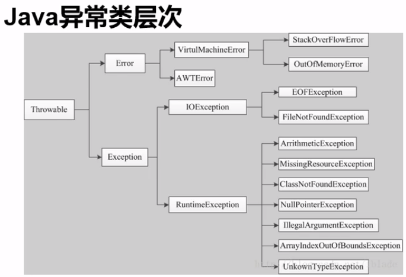

- [异常处理](#%e5%bc%82%e5%b8%b8%e5%a4%84%e7%90%86)
  - [1. 异常](#1-%e5%bc%82%e5%b8%b8)
  - [2. 异常处理机制](#2-%e5%bc%82%e5%b8%b8%e5%a4%84%e7%90%86%e6%9c%ba%e5%88%b6)

# 异常处理

## 1. 异常
- 在程序运行时出现
- 解决：1）结束程序；2）编写程序时考虑到错误检测、提示和处理
- 分类
> Error:JVM系统内部错误，资源耗尽等<br>
> Exception:因为编程错误或外在因素导致的一般性问题，如：
> - 空指针访问
> - 错误类型转换
> - 除数为0
> - 读取不存在的文件
> - 网络连接终端



## 2. 异常处理机制
- 异常处理机制防止程序中断，程序员只能处理Exception类型的异常
- 处理思路：1）捕获；2）抛出

- 1. 捕获异常处理try catch，防止程序可能出现的异常

```java
try
{}
catch() // 一种异常类型
{}
catch() // 一种异常类型
{}
finally // IO和JDBC异常经常会使用，可以省略不写
{}
```

例如：

```java
int t = 0;
try
{
        double m = 3 / i;
}
catch(Exception e) // 填入捕获的异常类型，如果不清楚，直接写父类Exception
{
        System.out.println(e.getMessage());; // 获取错误信息
        e.printStackTrace(); // 同上功能
        System.out.println("除数为0异常");// 或者自己写
}
System.out.println("hhh");
```

- 2. 抛出异常throws
> 1. 在方法处抛出异常，在调用方捕获异常

```java
public static void main(String[] args)
{
        A a = new A();

        try
        {
            a.test();
        }
        catch(Exception e)
        {
            System.out.println("捕获异常");
        }
}

// 文件A.java
public class A
{
        public int i;
        public void test() throws Exception // 方法定义时抛出异常
        {
            A b = null;
            System.out.println(b.i); // 空指针异常
        }
}
```

> 2. 重写方法不能抛出比被重写方法范围更大的异常类型

> 3. 异常可以被调用方继续抛出异常
> 4. 人工抛出异常

```java
public static void main(String[] args)
{
        A a = new A();

        try // 捕获异常
        {
            a.test(-10);
        }
        catch(Exception e)
        {
            e.printStackTrace();
        }
}

// 文件A.java
public class A{
        public int age;
        public void test(int age) throws Exception{ // 方法定义时抛出异常
        
            if(age >= 0 && age <= 100)
                throw new Exception("年龄在0到100之间"); // 人工抛出异常
            else
            {
                this.age = age;
                System.out.println("年龄是：" + age); // 空指针异常
            }
        }
}
```

> 4. 创建用户自定义异常类

```java
public static void main(String[] args)
{
    A a = new A();

    try // 捕获异常
    {
        a.test(-10);
    }
    catch(Exception e)
    {
        e.printStackTrace();
    }
}

// 文件A.java
public class A
{
    public int age;
    public void test(int age) throws Exception // 方法定义时抛出异常
    {
        if(age >= 0 && age <= 100)
            throw new MyException("年龄在0到100之间"); // 人工抛出异常
        else
        {
            this.age = age;
            System.out.println("年龄是：" + age); // 空指针异常
        }
    }
}

class MyException extends Exception // 创建自己的异常类
{
    MyException(String msg)
    {
        super(msg); // 调用父类的构造函数
    }
}

```


