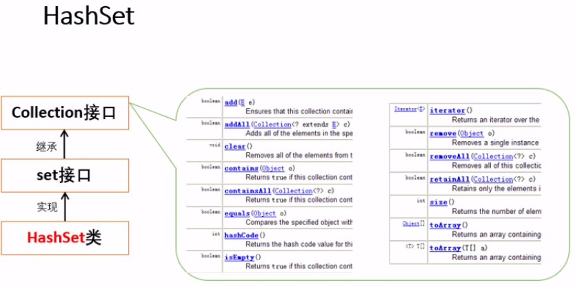
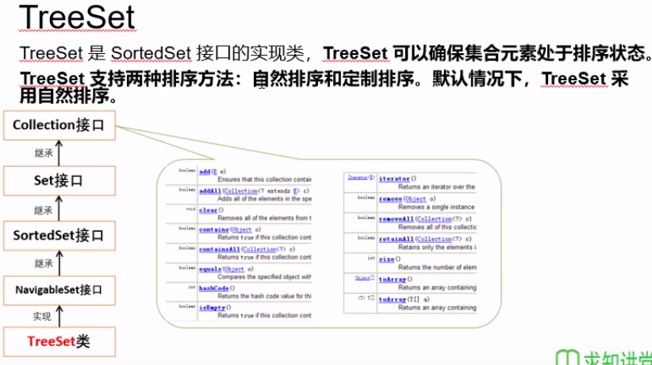
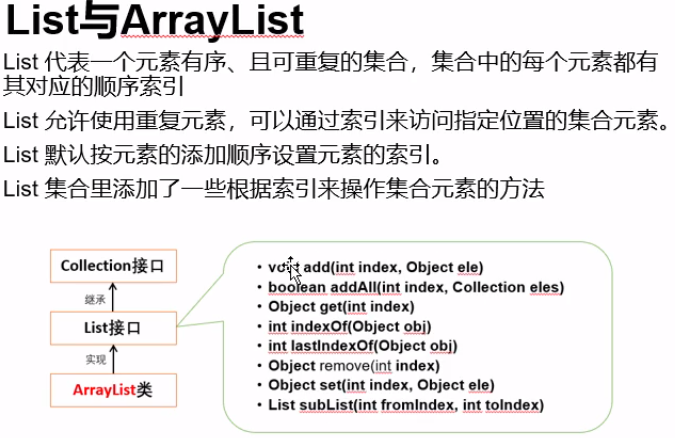
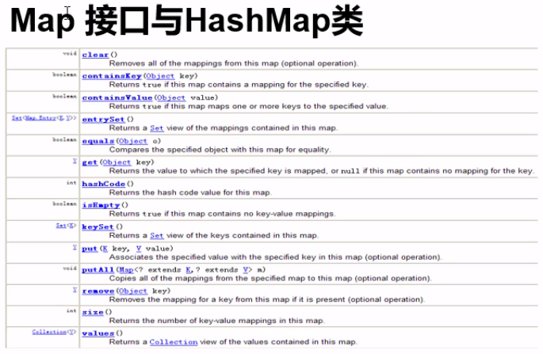
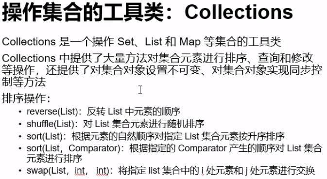
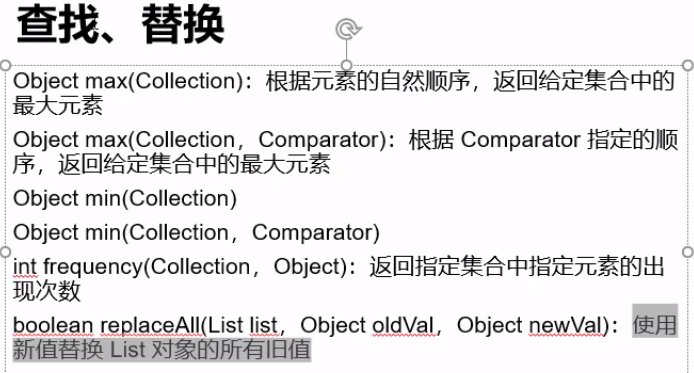
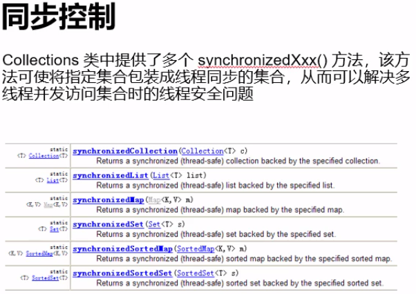

- [集合](#%e9%9b%86%e5%90%88)
  - [1. HashSet](#1-hashset)
  - [2. TreeSet](#2-treeset)
  - [3. List](#3-list)
  - [4. Map](#4-map)
  - [5. 工具类Collections](#5-%e5%b7%a5%e5%85%b7%e7%b1%bbcollections)

# 集合
- 存放于java.util包中，特点：
> 1. 只能存放对象，不能存放基本数据类型，会自动转换为响应的包装类
> 2. 存放的是对象的引用，对象本身在堆中
> 3. 可以存放不同的类型
- 分为：
> 1. Set：无序不可重复
> 2. List：有序可重复
> 3. Map：具有映射关系

## 1. HashSet
- 大多Set是指HashSet
- 按照hash算法存储元素的值，根据放入元素的hashCode()的值放入集合
- HashSet判断两个元素相等的条件是：equals()返回true且hashCode()也相当
- 特点：
> 1. 不可重复，指的是hashCode()的值不重复
> 2. 不是线程安全
> 3. 不保证元素排列顺序
> 4. 元素可以使用null
- HashSet方法：



```java
import java.util.Set;
import java.util.HashSet;

public class Test
{
    public static void main(String[] args)
    {
        Set s = new HashSet();
        s.add(1); // 添加元素
        s.add("abc");
        System.out.println(s); // 打印集合
        System.out.println(s.contains(1)); // 是否包含某元素boolean
        s.remove(1); // 移除元素
        s.clear(); // 情况Set
    }
}
```

- 遍历
> 1. 使用迭代器

```java
import java.util.Set;
import java.util.HashSet;

public class Test
{
    public static void main(String[] args)
    {
        Set s = new HashSet();
        s.add(1); // 添加元素
        s.add("abc");
        System.out.println(s); // 打印集合
        s.remove(1); // 移除元素
        
        Iterator it = s.iterator();
        while(it.hasNext())
        {
            System.out.println(it.next());
        }
    }
}
```

> 2. ```for each``` 常用

```java
import java.util.Set;
import java.util.HashSet;

public class Test
{
    public static void main(String[] args)
    {
        Set s = new HashSet();
        s.add(1); // 添加元素
        s.add("abc");
        System.out.println(s); // 打印集合
        s.remove(1); // 移除元素
        
        for(Object obj : s)
        {
            System.out.println(obj);
        }
    }
}
```

- 计算集合大小```size()```
- 使用泛型，使集合中只存放一种类型元素

```java
Set<String> s = new HashSet<String>();
```

## 2. TreeSet


- 排序调用的方法是TreeSet的```compareTo(Object obj)```方法，如下实现升序排序
> 1. ```this > obj; return 1;```
> 2. ```this < obj; return -1;```
> 3. ```this == obj; return 0;```

- 通常通过泛型指定类型，因为需要比较，不能相互转换的类型比较会发生异常
- 定制排序。自己写的类要放入TreeSet中，必须实现接口```Comparator<类名>```，里面有一个compare的方法需要重写，按照```compareTo(Object obj)```的比较方式，如果想要降序，大于小于对调

## 3. List


- List中元素按照加入顺序存放
- 一般List值得就是ArrayList
- ArrayList是线程不安全的
- Vector也是List中的一种，虽然是线程安全的，但是仍不建议使用

## 4. Map


- 存放具有映射关系的key和value
- 有HashMap、TreeMap、HashTable(基本不用)
- HashMap线程不安全
- TreeMap对key自然排序

## 5. 工具类Collections
- 类似c++中的算法algorithm





