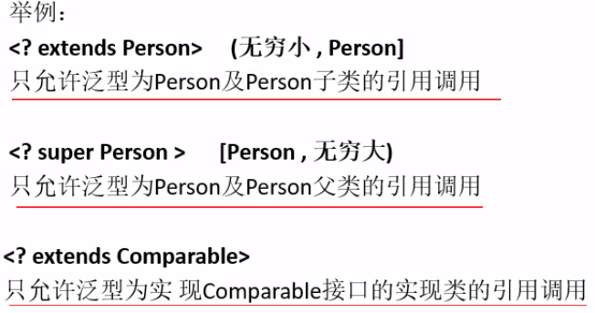

- [泛型](#%e6%b3%9b%e5%9e%8b)
  - [1. 泛型的使用](#1-%e6%b3%9b%e5%9e%8b%e7%9a%84%e4%bd%bf%e7%94%a8)
  - [2. 泛型通配符](#2-%e6%b3%9b%e5%9e%8b%e9%80%9a%e9%85%8d%e7%ac%a6)

# 泛型

- java中泛型只在编译阶段有效

## 1. 泛型的使用 
- 泛型类

java
```java
public class A<T>
{
    private T i;
    public void set(T value)
    {
        i = value;
    }
}
```

c++

```c++
template <typename T>
class A
{
private:
    T i;
    void set(T value);
};

template <typename T>
void A::set(T value)
{
    i = value;
}
```

- 泛型接口

```java
public interface IB<T>
{
    T set(T value);
}

class A<T> implements IB<T> // 实现接口时没有指定类型
{
    public T set(T value){return value;}
}

class A implements IB<String> // 实现接口时指定类型
{
    public String set(String value){return value;}
}
```

- 泛型方法

```java
public class A
{
    public <T> void set(T value) // 参数为泛型
    {
        T i = value;
    }

    public <T> T set(T value) // 返回值为泛型
    {
        return value;
    }

    public static <T> T set(T value) // 静态方法定义为为泛型
    {
        return value;
    }
}
```

## 2. 泛型通配符

- ```?```类似```T```，表示未知类型
- 有限制的通配符




