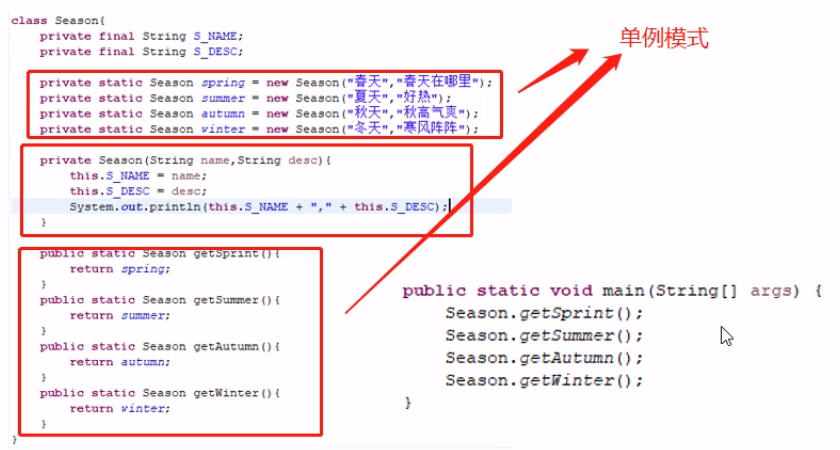

- [枚举与注解](#%e6%9e%9a%e4%b8%be%e4%b8%8e%e6%b3%a8%e8%a7%a3)
  - [枚举类](#%e6%9e%9a%e4%b8%be%e7%b1%bb)
  - [注解](#%e6%b3%a8%e8%a7%a3)

# 枚举与注解

## 枚举类
- 关键字enum，适用于种类个数已知且不会变
- 实际实现是单例模式，每一个枚举项都是枚举类中的一个单例构造



- 使用枚举类创建的枚举对象是单例的，每次获取的值都是同一个对象


- 枚举类可以实现接口

## 注解


- 使用```@```开头
- 1. 已有的annotation


- 2. 自定义的annotation
> 使用关键字```@interface```
> 需要注明对什么作注解（概述中提到的类、类的属性、方法等）```@Target```，及其声明周期```@Retention```


