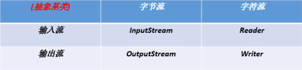
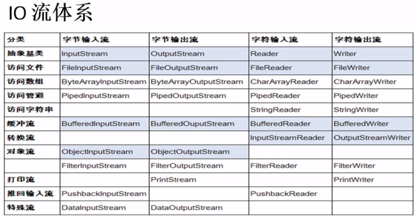
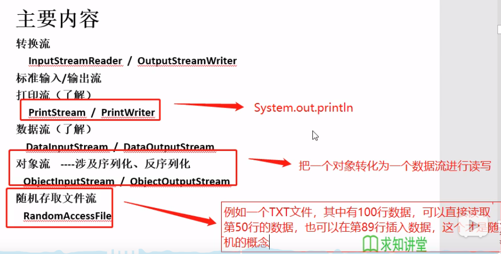
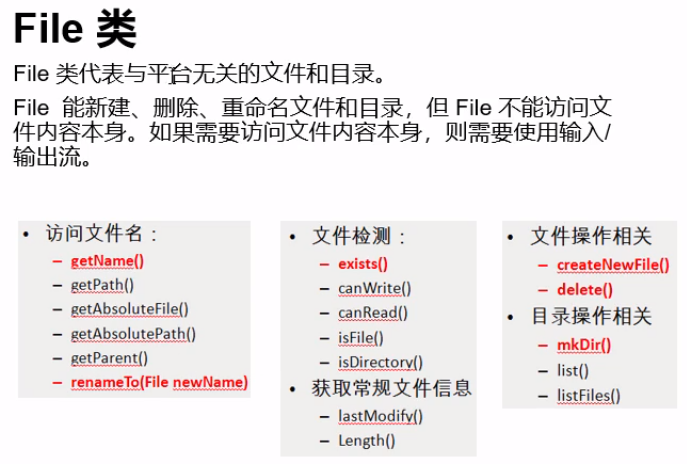

- [IO流](#io%e6%b5%81)
	- [File类](#file%e7%b1%bb)
	- [文件字节流](#%e6%96%87%e4%bb%b6%e5%ad%97%e8%8a%82%e6%b5%81)
	- [文件字符流](#%e6%96%87%e4%bb%b6%e5%ad%97%e7%ac%a6%e6%b5%81)
	- [缓冲字节流](#%e7%bc%93%e5%86%b2%e5%ad%97%e8%8a%82%e6%b5%81)
	- [缓冲字符流](#%e7%bc%93%e5%86%b2%e5%ad%97%e7%ac%a6%e6%b5%81)
	- [转换流](#%e8%bd%ac%e6%8d%a2%e6%b5%81)
	- [标准输入输出流](#%e6%a0%87%e5%87%86%e8%be%93%e5%85%a5%e8%be%93%e5%87%ba%e6%b5%81)
	- [打印流](#%e6%89%93%e5%8d%b0%e6%b5%81)
	- [数据流](#%e6%95%b0%e6%8d%ae%e6%b5%81)
	- [对象流](#%e5%af%b9%e8%b1%a1%e6%b5%81)
	- [随机存取流](#%e9%9a%8f%e6%9c%ba%e5%ad%98%e5%8f%96%e6%b5%81)
	- [总结](#%e6%80%bb%e7%bb%93)


# IO流
- 处理设备间数据传输
- 需要异常捕获```try catch```





- 文件流
- 缓冲流



## File类
- java.io.File类
- 可以新建、删除、重命名类，但是不能访问文件本身。访问内容需要使用输入输出流

``` java
import java.io.File;

// 创建
File f = new File("D:\\t.txt"); // "D:/t.txt"或 "D: " + File.separator + "t.txt"”

```



## 文件字节流
- 可以操作图片、文件等，是二进制的字节流
- 输入流

```java
import java.io.FileInputStream;
public static void main(String[] args)
{
    FileInputStream file = new FileInputStream("路径");

    byte[] b = new byte[10];

    int len = 0;
    while((len = file.read(b)) != 0)
        file.read(b); // 返回读取的字节数

    System.out.println(new String(b, 0, len));

    file.close();
}
```


- 输出流

```java
import java.io.FileOutputStream;
public static void testFileOutputStream() throws Exception
{
    FileOutputStream file = new FileOutputStream("路径");

    String str = "i love China!";

    file.write(str.getBytes()); 

    file.flush(); // 将内存中数据刷写入硬盘
    file.close();
}
```

## 文件字符流
- 只适合操作内容为字符的文件
- 类名```FileReader```， ```FileWriter```
- 上面byte数组改为char数组

## 缓冲字节流
- 上述文件操作是基于磁盘的，读写速度受限制；通过缓冲流将数据写入内存，基于内存的io操作是基于硬盘的快75000倍
- 类名```BufferedInputStream```， ```BufferedOutputStream```
- 顺序：文件 -》 内存 -》 处理 -》 内存 -》 文件

## 缓冲字符流
- 上述文件操作是基于磁盘的，读写速度受限制；通过缓冲流将数据写入内存，基于内存的io操作是基于硬盘的快75000倍
- 类名```BufferedReader```， ```BufferedWriter```


## 转换流
- 如果是字符文件的的话，使用字符流处理方便，所以提供字节流与字符流间的转换
- 字节转字符类名```InputStreamReader```， ```OutputStreamReader```

```java
FileInputStream file  = new FileInputStream("path"); // 读入文件字节流
InputStreamReader inf = new InputStreamReader(file, "GBK"); // 字节流转字符流
```

- 在转换字符流时，设置的编码格式要与读取文件的一致，否则乱码

## 标准输入输出流
 - ```System.in```和```System.out```
 - 输入流使用

```java
InputStreamReader is = new InputStreamReader(System.in); // 创建接收键盘输入的输入流
BufferedReader  br = new BufferedReader(is); // 将输入流放入缓冲流中
String str = "";
while((str = br.readLine()) != null) // 读取整行输入
{
    System.out.println(str);
}

br.close();
is.close();
```

## 打印流
- 类名```PrintStream```和```PrintWriter```
- 不会抛出异常
- 自动flush
- System.out输出的就是```PrintStream```实例

## 数据流
- 基本数据类型的写入读取
- 写入到文件后打开是乱码，需要通过数据流读取，同时类型使用要一致

## 对象流
- 保存对象到硬盘或网络传输（对象持久化），针对的是对象，所以```static```和```transient```修饰的不可以转换
- 类需要实现接口Serializable

```java
// Person类
package day13;
import java.io.Serializable;

/**
 * 创建用来序列化和反序列化的类
 * @author LJY
 *
 */
public class Person implements Serializable{

	/**
	 * 一个表示序列化版本标识符的静态变量
	 * 表明类的不同版本间的兼容性
	 */
	private static final long serialVersionUID = 1L;
	
	String name;
	int age;
}
```

- 类名```ObjectOutputStream```和```ObjectInputStream```
- 序列化：对象写入IO流
- 反序列化：从IO流中恢复对象

```java
package day13;
import java.io.FileInputStream;
import java.io.FileOutputStream;
import java.io.ObjectInputStream;
import java.io.ObjectOutputStream;

/**
 * 序列化与反序列化
 * @author LJY
 *
 */
public class test {
	public static void main(String[] args) {
		try {
//			testSerialize();
			testDeserialize();
		} catch (Exception e) {
			// TODO Auto-generated catch block
			e.printStackTrace();
		}
	}
	
	/**
	 * 对象序列化
	 */
	public static void testSerialize() throws Exception
	{
		// 指定对象流的输出文件
		ObjectOutputStream os = new ObjectOutputStream(new FileOutputStream("F:\\06java\\Calcu\\src\\day13\\1.txt"));
		
		Person p = new Person();
		p.name = "ice";
		p.age = 18;
		
		os.writeObject(p); // 对象写入文件
		
		os.flush(); // 数据写入硬盘
		os.close();
	}
	
	/**
	 * 对象反序列化
	 * @throws Exception
	 */
	public static void testDeserialize() throws Exception
	{
		// 指定对象流的输入文件
		ObjectInputStream is = new ObjectInputStream(new FileInputStream("F:\\06java\\Calcu\\src\\day13\\1.txt"));
		
		Object o = is.readObject(); // 返回一个对象
		
		Person p = (Person)o; // 类型强制转换
		
		System.out.println(p.name);
		System.out.println(p.age);
	}
}
```
- 注意：序列化和反序列化的类所在包名、类名、类结构要严格一致，否则强制类型转换失败

## 随机存取流
- 可以读取或写入在文件中任何位置，当写入不在末尾时，回覆盖内容
- 第二参数，常用"r"和"rw"
> 1. "r"：只读
> 2. "rw"：读写
> 3. "rwd"：同步内容的更新
> 4. "rws"：同步内容和源数据的更新

```java
/**
	* 随机读取
	* @throws Exception
	*/
public static void testRandomAccessFile() throws Exception
{
	RandomAccessFile is = new RandomAccessFile("F:\\06java\\Calcu\\src\\day13\\1.txt", "r");
	
	is.seek(0); // 设置读取起始位置
	
	byte[] b = new byte[1024];
	
	int len = 0;
	while((len = is.read(b)) != -1)
	{
		System.out.println(new String(b, 0, len));
	}
	
	is.close();
}

/**
	* 随机写入
	* @throws Exception
	*/
public static void testRandomAccessFileWrite() throws Exception
{
	RandomAccessFile is = new RandomAccessFile("F:\\06java\\Calcu\\src\\day13\\1.txt", "rw");
//		is.seek(0); // 首部写入
	is.seek(is.length());// 相当于追加
	
	is.write("hello".getBytes());
	is.close();
}
```

## 总结
- 区分清数据来源、用什么方式处理、目的去向
- 数据来源：文件、键盘
- 目的去向：文件、设备


