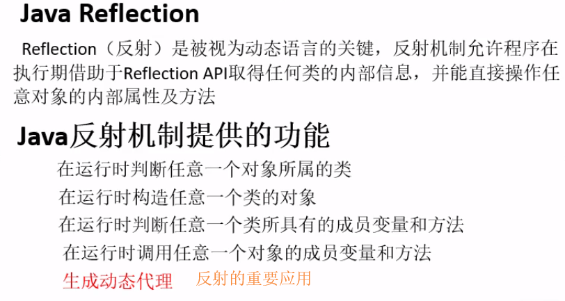
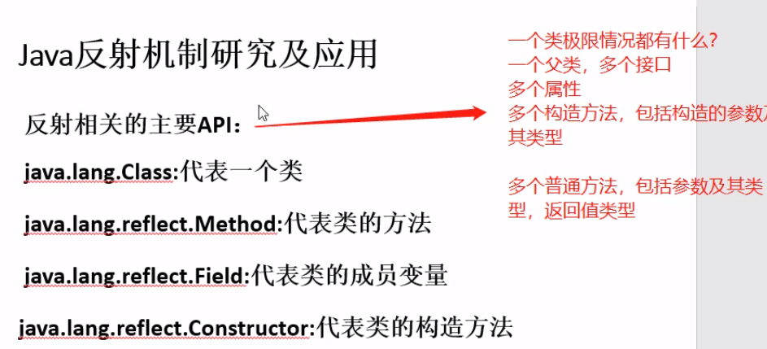
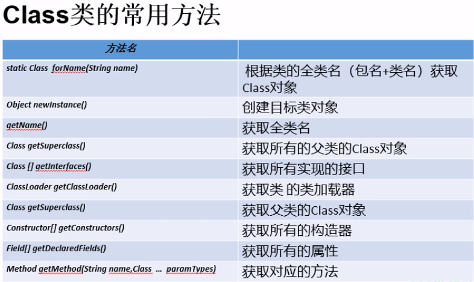
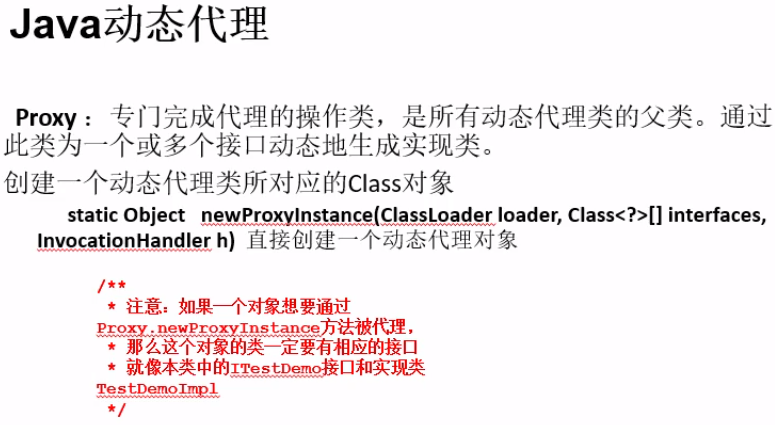

- [反射](#%e5%8f%8d%e5%b0%84)
	- [Class类](#class%e7%b1%bb)
		- [创建实例方式](#%e5%88%9b%e5%bb%ba%e5%ae%9e%e4%be%8b%e6%96%b9%e5%bc%8f)
	- [动态代理](#%e5%8a%a8%e6%80%81%e4%bb%a3%e7%90%86)

# 反射
- 人：通过一个抽象的名字，搜寻匹配的画面；
- java：通过类名，找到类的具体信息，必须jvm已经加载过该类






## Class类
- 通过Class类统一描述所有类，其本身就是一个类
- 一个类在JVM中只会有1个Class实例
- Class对象只能由系统建立对象，1个Class对象对应于加载到JVM中的一个.class文件
- 通过Class可以获取到类的全部信息



### 创建实例方式

```java
package day14;

public class test {
	public static void main(String[] args) {
		// 方法1：通过类实例创建Class对象
		Person p = new Person();
		Class c1 = p.getClass(); 
		
		// 方法2：通过类名创建Class对象
		Class c2 = Person.class;
		
		// 方法3：通过Class静态方法创建Class对象，最常用
		try {
			Class c3 = Class.forName("day14.Person");
		} catch (ClassNotFoundException e) {
			// TODO Auto-generated catch block
			e.printStackTrace();
		}
	}
}
```

## 动态代理



