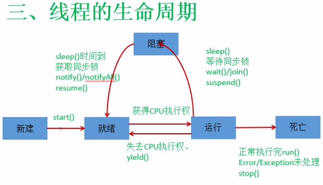

- [线程](#%e7%ba%bf%e7%a8%8b)
	- [多线程的创建和启动](#%e5%a4%9a%e7%ba%bf%e7%a8%8b%e7%9a%84%e5%88%9b%e5%bb%ba%e5%92%8c%e5%90%af%e5%8a%a8)
		- [创建](#%e5%88%9b%e5%bb%ba)
	- [线程的生命周期](#%e7%ba%bf%e7%a8%8b%e7%9a%84%e7%94%9f%e5%91%bd%e5%91%a8%e6%9c%9f)
	- [线程同步](#%e7%ba%bf%e7%a8%8b%e5%90%8c%e6%ad%a5)
	- [线程通信](#%e7%ba%bf%e7%a8%8b%e9%80%9a%e4%bf%a1)
	- [生产者和消费者](#%e7%94%9f%e4%ba%a7%e8%80%85%e5%92%8c%e6%b6%88%e8%b4%b9%e8%80%85)

# 线程

## 多线程的创建和启动
- ```java.lang.Thread```类
- 将多线程运行逻辑写入```run()```方法中
- 通过```start()```启动线程

### 创建
1. 继承Thread
测试类

```java
package day15;

public class TestThread extends Thread{
	@Override
	public void run() { // 重写父类的run方法
		System.out.println("这是多线程的代码");
		
		for(int i = 0; i < 5; ++i)
		{
			System.out.println("多线程执行代码" + i);
		}
	}
}
```

主函数

```java
package day15;

public class Test {
	public static void main(String[] args) {
		Thread t = new TestThread(); // 创建多线程对象
		t.start(); // 启动多线程
		System.out.println("--------------------1");
		System.out.println("--------------------2");
		System.out.println("--------------------3");
	}
}
```

1. 实现Runnable接口

```java
package day15;

public class TestRunnable implements Runnable{
	@Override
	public void run() {
		System.out.println(Thread.currentThread().getName() + "这是多线程的代码");
		
		for(int i = 0; i < 5; ++i)
		{
			System.out.println("多线程执行代码" + i);
		}
	}
}
```

```java
package day15;

public class Test {
	public static void main(String[] args) {
//		Thread t = new Thread(new TestRunnable());
		Thread t = new Thread(new TestRunnable(), "t-1"); // 带线程名的线程创建
		t.start();
		System.out.println("--------------------1");
		System.out.println("--------------------2");
		System.out.println("--------------------3");
	}
}
```

- 通常采用实现接口的方式，好处如下：
> 1. 可以不影响单继承
> 2. 多个线程可以共享同一个实现类对象中的共享资源

线程间存在优先级，从1-10，优先级越高，执行概率越高
- 相关方法
> ```yeild()```方法，暂停线程执行，让步给同等或更高优先级的线程执行。若没有同等或更高，则忽略此方法<br>
> ```join()```方法，相当于将线程的方法插入到join处执行，是同步的，即阻塞插入位置处的代码执行，先将线程中程序执行完才能执行之后的代码<br>
> ```sleep()```方法，使当前线程在该时间段内放弃对CPU的控制，使其他线程有机会去执行，时间到后重新竞争CPU<br>
> ```stop()```方法，强制结束线程<br>
> ```isAlive()```方法，判断线程是否还活着

## 线程的生命周期
- 新建：线程实例的创建
- 就绪：调用```start()```方法后
- 运行：占用CPU，```run()```执行
- 阻塞：```run()```方法中代码暂停执行
- 死亡：自然和强制死亡



## 线程同步
- 通过在处理共享数据的方法前加```synchronized```关键字可以实现锁的机制，称为同步锁

```java
public synchronized void test(){}
```

- 此时锁的是整个对象，而不是一个方法，不同的对象是不同的锁；如果该方法为static，则对所有对象使用同一个锁
- 锁某段代码块

```java
public void test(){
    synchronized(this){ // 表示锁的是当前对象的该段代码
        ...
    }
}
```

如果在其他方法中也用```synchronized(this)```加锁，则所有的锁是同一个同步锁;<br>

如果想要用不同的对象使用不同的锁，需要从方法中传入对象，使用```synchronized(对象)```

```java
public void test(A a){
    synchronized(a){ // 表示锁的是当前对象的该段代码
        ...
    }
}
```

## 线程通信
- ```wait()```，使当前进程放弃CPU和同步资源，挂起等待
- ```notify()```，唤醒正在排队中的优先级最高的线程
- ```notifyAll()```,唤醒所有
- 上述三个方法**只能用在使用同步锁的修饰的方法中或使用同步锁的代码块中**

## 生产者和消费者
利用```wait()```和```notify()```实现


