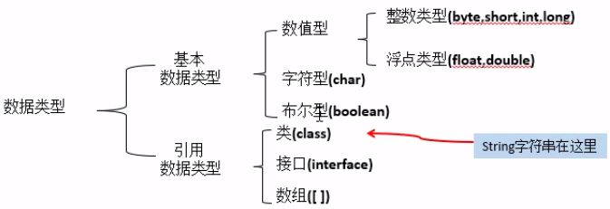
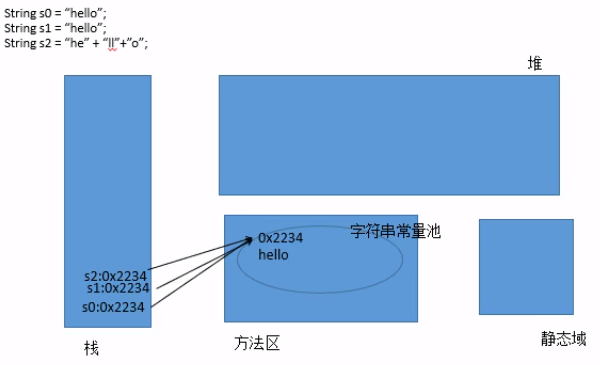
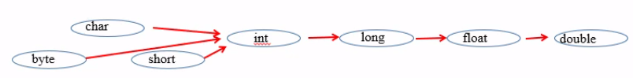

- [基础语法](#%e5%9f%ba%e7%a1%80%e8%af%ad%e6%b3%95)
  - [1. 关键字和保留字](#1-%e5%85%b3%e9%94%ae%e5%ad%97%e5%92%8c%e4%bf%9d%e7%95%99%e5%ad%97)
  - [2. 标识符](#2-%e6%a0%87%e8%af%86%e7%ac%a6)
  - [3. 变量](#3-%e5%8f%98%e9%87%8f)
  - [4. 数据类型](#4-%e6%95%b0%e6%8d%ae%e7%b1%bb%e5%9e%8b)
    - [基本数据类型](#%e5%9f%ba%e6%9c%ac%e6%95%b0%e6%8d%ae%e7%b1%bb%e5%9e%8b)
    - [引用类型](#%e5%bc%95%e7%94%a8%e7%b1%bb%e5%9e%8b)
    - [基本数据类型转换](#%e5%9f%ba%e6%9c%ac%e6%95%b0%e6%8d%ae%e7%b1%bb%e5%9e%8b%e8%bd%ac%e6%8d%a2)
    - [强制类型转换](#%e5%bc%ba%e5%88%b6%e7%b1%bb%e5%9e%8b%e8%bd%ac%e6%8d%a2)
  - [5. 运算符](#5-%e8%bf%90%e7%ae%97%e7%ac%a6)

# 基础语法

## 1. 关键字和保留字
- 关键字：事先定义好的具有特殊含义的单词
- 保留字：以后可能被定为关键字的单词
- 特点：所有的关键字都是小写

## 2. 标识符
- 标识符：凡是可以自己起名字的
- 组成：字母、数字、_、$，但数字不可以开头，要“见名知意”
- 命名规范：
- - 包名：所有小写xxyyzz
- - 类名、接口名：XxYyZz
- - 变量名：xxYyZz
- - 常量名：XX_YY_ZZ
  
## 3. 变量
- 存储在内存中
- 具有有变量名和类型
- 必须先声明后使用
- 必须初始化后才能使用

## 4. 数据类型


除了8种基本数据类型外的都是引用数据类型。

### 基本数据类型
- 整数类型：
  
| 类型 | 存储空间 | 范围 |
| --- | --- | --- |
| byte | 1字节 | -128到127 |
| short | 2字节 | $-2^{15}$到$2^{15}-1$ |
| int | 4字节 | $-2^{31}$到$2^{31}-1$ |
| long | 8字节 | $-2^{63}$到$2^{63}-1$ |

> 定义long需要加“l”或“L”

- 浮点类型

| 类型 | 存储空间 | 范围 | 精度
| --- | --- | --- | --- |
| float | 4字节 | $-2^{128}$到$2^{128}$ | 7位有效数字 |
| double | 5字节 | $-2^{1024}$到$2^{1024}$ | 16位有效数字 |

> 默认double类型，定义float需要加“f”或“F”

- 字符类型char
- 布尔类型boolean
> 只有true和false，不能用非0或0表示

### 引用类型

所有引用类型可以以null作为值

- 字符串String

> 1. 值不可变，常量
> 2. 字符串存放在字符串常量池中
> 3. 当出现2个一样值的字符串时，两个指向同一个内存地址，保证同样的常量值在内存中只出现1次



### 基本数据类型转换
- 自动数据类型转换：小类型转大类型


- **byte、char和short间不能相互转换**，混合运算时会自动转为int类型再计算
- 任何基本类型的值与字符串做“+”运算，结果为字符串
```java
// 遵从运算顺序
System.out.println("hello" + 1 + 2); // hello12
System.out.println(1 + 2 + "hello"); // 3hello
System.out.println("hello" + 'a' + 2); // helloa2
System.out.println('a' + 2 + "hello"); // 99hello
```

### 强制类型转换
- 基本数据类型间
```java
int a = 5;
byte b = (byte)a;
```

- 字符串转基本类型需要使用相应的包装类
```java
String a = "43";
int b = integer.parseInt(a);
```
- boolean不能转换为其他类型

## 5. 运算符

- 等号可以连续赋值
```
i1 = i2 = i3 = 5;
```

- "=" 与“+=”
```
byte a = 3;
a = a + 3; // 结果为6，但是这里是int类型
a += 3; // 结果为6，这里自动转为原数据类型
```

- “&”与“&&”
> & 不论左边真假，右边均参与运算；
> && 左边为假，右边不参与运算

- “>>”与“>>>”
> \>>带符号的移位；
> \>>>无符号移位，没有“<<<”


