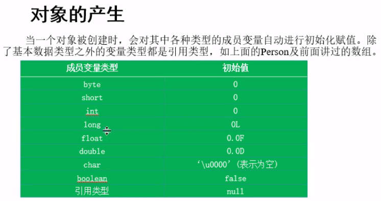
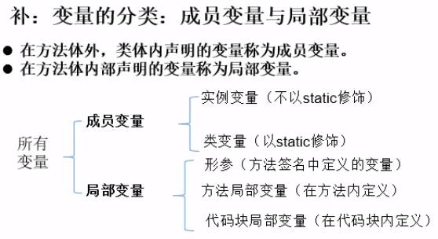

- [面向对象](#%e9%9d%a2%e5%90%91%e5%af%b9%e8%b1%a1)
  - [面向对象与面向过程](#%e9%9d%a2%e5%90%91%e5%af%b9%e8%b1%a1%e4%b8%8e%e9%9d%a2%e5%90%91%e8%bf%87%e7%a8%8b)
  - [三大特性](#%e4%b8%89%e5%a4%a7%e7%89%b9%e6%80%a7)
  - [java类及类成员](#java%e7%b1%bb%e5%8f%8a%e7%b1%bb%e6%88%90%e5%91%98)
    - [1. 类成员](#1-%e7%b1%bb%e6%88%90%e5%91%98)
    - [2. 类的实例化](#2-%e7%b1%bb%e7%9a%84%e5%ae%9e%e4%be%8b%e5%8c%96)

# 面向对象

## 面向对象与面向过程

- 面向过程：专注于一个行为动作
- 面向对象：将行为动作归属于对象

## 三大特性
- 封装
- 继承
- 多态

## java类及类成员


### 1. 类成员
- 属性：类由什么构成，可以直接声明不初始化，会有默认值

> 1. 相比c++中应该给所有属性初始值
> 2. 分为
> - 实例变量：类实例化之后才可以使用的变量
> - 类变量：使用static修饰，不需要类实例化就有
> 
> 
> 
> - 实例变量存在于类对象所在的堆空间中
> - 局部变量在栈中，没有初始值，需要显示初始化。

- 行为：类有什么动作行为


---
- 语法格式： 
> 1. 相比c++块标注访问说明符，java在类前、属性前和函数前都加了访问说明符---修饰符

```java
修饰符 class 类名{
    // 属性
    修饰符 类型 属性名; 

    // 行为、方法、函数
    /**
     * 文档型注释
     */
    修饰符 返回类型 函数名(){

    }
}
```

- 方法的重载overload

> 同名的函数，不同的形参

### 2. 类的实例化
```java
类名 test1 = new 类名();
new 类名().方法(); // 匿名变量
```

- java没有```#include```，只要类与main在的同一个package下，在main中就可以实例化相应的类对象。
- 匿名变量相当于临时变量。


