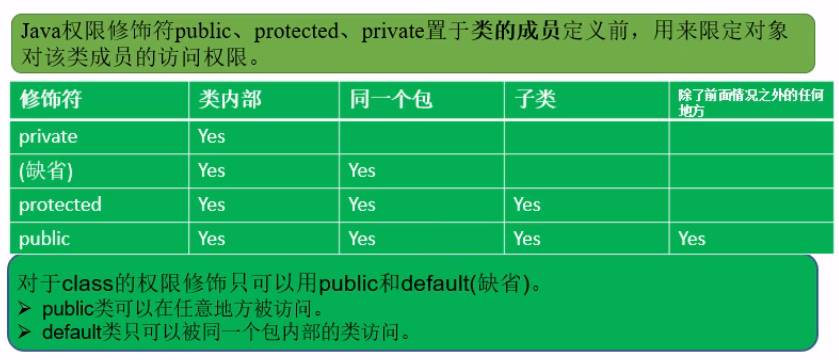

- [1. 可变参数个数的函数](#1-%e5%8f%af%e5%8f%98%e5%8f%82%e6%95%b0%e4%b8%aa%e6%95%b0%e7%9a%84%e5%87%bd%e6%95%b0)
- [2. 参数传递方式](#2-%e5%8f%82%e6%95%b0%e4%bc%a0%e9%80%92%e6%96%b9%e5%bc%8f)
- [3. 软件包](#3-%e8%bd%af%e4%bb%b6%e5%8c%85)
- [4. 特性之一：封装](#4-%e7%89%b9%e6%80%a7%e4%b9%8b%e4%b8%80%e5%b0%81%e8%a3%85)
- [5. 四种访问修饰符](#5-%e5%9b%9b%e7%a7%8d%e8%ae%bf%e9%97%ae%e4%bf%ae%e9%a5%b0%e7%ac%a6)
- [6. 类的构造方法](#6-%e7%b1%bb%e7%9a%84%e6%9e%84%e9%80%a0%e6%96%b9%e6%b3%95)
- [7. 关键字this](#7-%e5%85%b3%e9%94%ae%e5%ad%97this)
- [8. javaBean](#8-javabean)


# 1. 可变参数个数的函数

格式：```类型... 参数名```

```java
public class Test
{
    public static void printInfo(String... args1)
    {
        for(int i = 0; i < arg1.length; i ++)
            System.out.println(arg1[i]);
    }
}
```

- 与数组使用方式相同
- java中用length成员变量代替c++中的.size()求长度
- 有多种类型的形参时，有可变参数的一定要放到最后```public static void printInfo(int a, String... args1)```

# 2. 参数传递方式


- java中参数传递只有一种：值传递
> 1. 基本数据类型值传递，不能修改值
> 2. 引用数据类型由于值传递的是地址，所以可以修改对应堆中的值

# 3. 软件包
- 在Java中包package的概念同文件夹一样，解决文件管理问题
- 包的层级结构用.分隔，通常为小写字母
> 如：最外级com，次级cn，再下级test，在com包中新建Test1的类，则文件生成如下：

```java
package com;
public class Test1
{
    public static void main(String[] args)
    {

    }
}
```

> 如果在cn包下有一个Person类，在com中的main想要使用这个Person类，则需要导入或指明。<br>
> - 方法1：import，类似using namespace std::cout;
 
 ```java
package com;
import com.cn.Person; // 导入
public class Test1
{
    public static void main(String[] args)
    {
        Person p = new Person();
    }
}
 ```

> - 方法3：import *，类似using namespace std;下的所有

```java
package com;
import com.cn.*; // 全部导入，粗暴
public class Test1
{
    public static void main(String[] args)
    {
        Person p = new Person();
    }
}
 ```

> - 方法2：类似std::cout的方式

```java
package com;
public class Test1
{
    public static void main(String[] args)
    {
        com.cn.Person p = new com.cn.Person(); // 每次专门写明
    }
}
 ```

- java自带的核心包


# 4. 特性之一：封装

变量声明为private，可以通过get和set设置属性

# 5. 四种访问修饰符


- 属性和方法均可缺省
- class只能有public和缺省两种，在一个文件内的多个类中只能有一个public的修饰，其他只能是缺省的

# 6. 类的构造方法
- 类的构造函数也要写访问修饰符
- 默认构造函数的访问修饰符同类的访问修饰符

# 7. 关键字this
```java
this.age = age;
```

# 8. javaBean
- java语言写成的可重用组件，是一个类
- 该类的属性为私有，方法为set和get，可以手写也可以自动生成：右键-》source-》generate getter and setter


