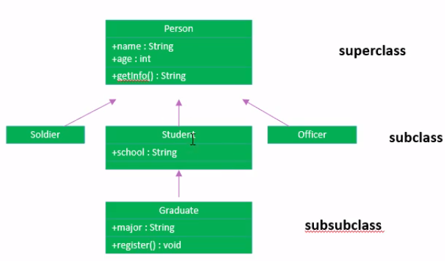
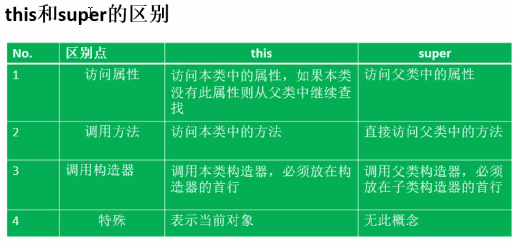
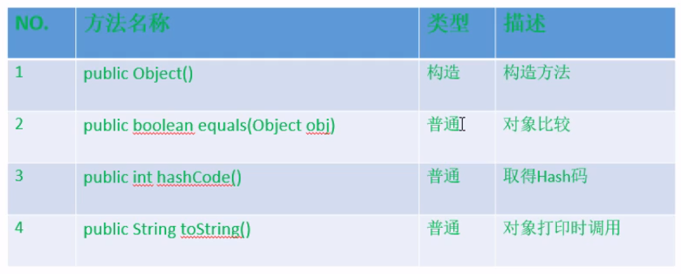
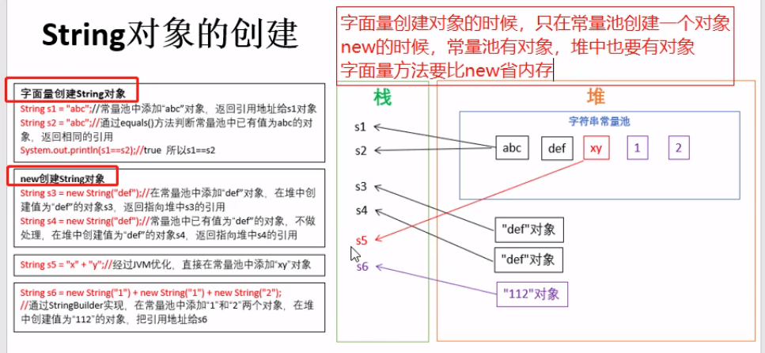
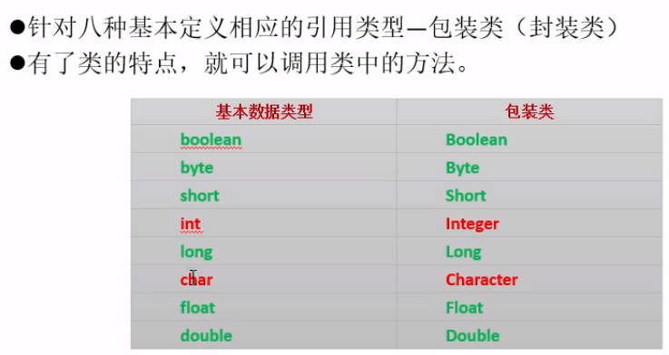
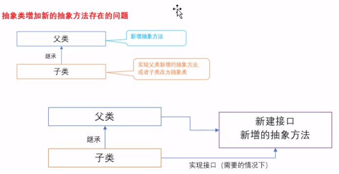
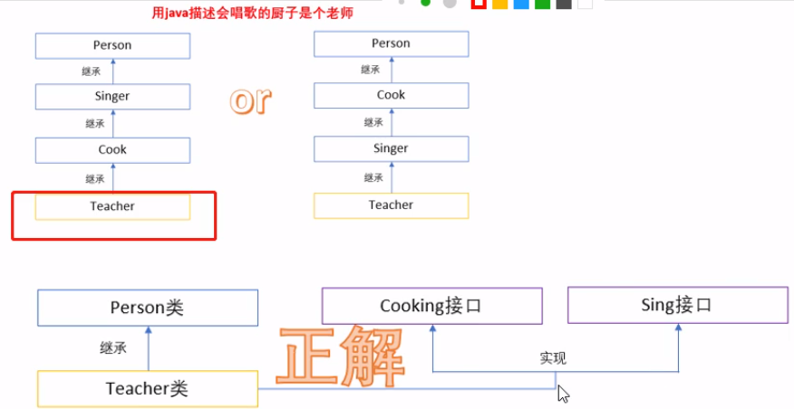
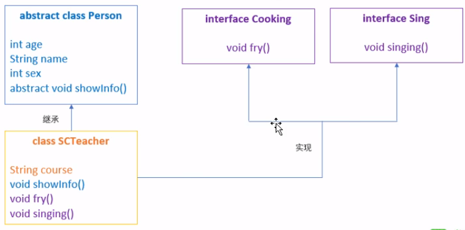
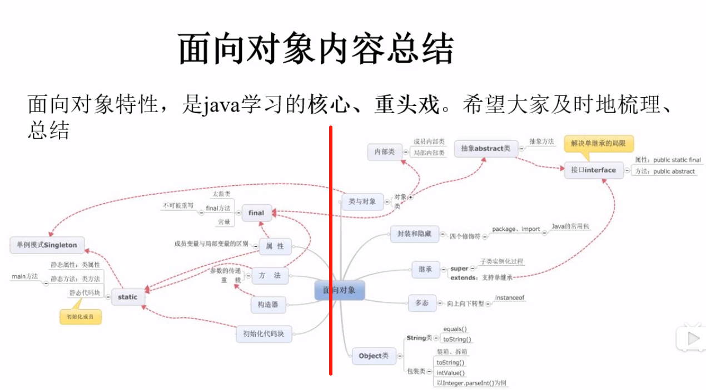

- [高级特性](#%e9%ab%98%e7%ba%a7%e7%89%b9%e6%80%a7)
  - [1. 特性二：继承](#1-%e7%89%b9%e6%80%a7%e4%ba%8c%e7%bb%a7%e6%89%bf)
  - [2. 方法的重写(覆盖override)](#2-%e6%96%b9%e6%b3%95%e7%9a%84%e9%87%8d%e5%86%99%e8%a6%86%e7%9b%96override)
  - [3. 关键字super](#3-%e5%85%b3%e9%94%ae%e5%ad%97super)
  - [4. 特性三：多态性](#4-%e7%89%b9%e6%80%a7%e4%b8%89%e5%a4%9a%e6%80%81%e6%80%a7)
  - [5. instanceof操作符](#5-instanceof%e6%93%8d%e4%bd%9c%e7%ac%a6)
  - [6. Object类](#6-object%e7%b1%bb)
    - [==与equals比较](#%e4%b8%8eequals%e6%af%94%e8%be%83)
  - [7. 类型转换Casting](#7-%e7%b1%bb%e5%9e%8b%e8%bd%ac%e6%8d%a2casting)
  - [8. String对象的创建](#8-string%e5%af%b9%e8%b1%a1%e7%9a%84%e5%88%9b%e5%bb%ba)
  - [9. 包装类Wrapper Class](#9-%e5%8c%85%e8%a3%85%e7%b1%bbwrapper-class)
    - [装箱与拆箱](#%e8%a3%85%e7%ae%b1%e4%b8%8e%e6%8b%86%e7%ae%b1)
    - [字符串与基本数据类型的转换](#%e5%ad%97%e7%ac%a6%e4%b8%b2%e4%b8%8e%e5%9f%ba%e6%9c%ac%e6%95%b0%e6%8d%ae%e7%b1%bb%e5%9e%8b%e7%9a%84%e8%bd%ac%e6%8d%a2)
  - [10. static](#10-static)
  - [11. main解读](#11-main%e8%a7%a3%e8%af%bb)
  - [12. 类中的初始化块](#12-%e7%b1%bb%e4%b8%ad%e7%9a%84%e5%88%9d%e5%a7%8b%e5%8c%96%e5%9d%97)
  - [13. final](#13-final)
  - [14. 抽象类-abstract](#14-%e6%8a%bd%e8%b1%a1%e7%b1%bb-abstract)
  - [15. 接口](#15-%e6%8e%a5%e5%8f%a3)
  - [16. 内部类](#16-%e5%86%85%e9%83%a8%e7%b1%bb)
  - [17. 面向对象总结](#17-%e9%9d%a2%e5%90%91%e5%af%b9%e8%b1%a1%e6%80%bb%e7%bb%93)


# 高级特性

## 1. 特性二：继承
```java
public class Student extends Person // 继承关键字
{}
```

- extends
- B is a A
- 不支持多继承，可以多层继承

- 当子类与父类在同一个包下，则处了private的都可以使用
- 当子类与父类不在同一个包下，则只能使用protected和public的

## 2. 方法的重写(覆盖override)
- 快捷键alt+/选择要重写的方法
- 方法同名并参数一致
- 子类在override时访问权限不能比父类更严格

## 3. 关键字super
- 子类通过super指定父类的成员
- 子类通过super指定父类的父类的成员，但只需要一个super即可
- 子类的构造函数会默认调用父类的无参构造器
- 如果父类没有无参构造器时，子类必须显示构建有参的构造器，并调用父类的构造方法，写到第一行
```java
public Kid(int age){
    super(age);
}
```


- 在子类中通过this和super调用构造函数时，只能使用一个，因为他们都要放在首行。

## 4. 特性三：多态性
- 方法的重载与重写
- 对象的多态性，当编译时与运行时的类型不同就出现多态---动态绑定
- 前提：
> 1. 有继承
> 2. 子类重写父类方法

> 在c++中，运行时多态需要具备以下3点：
> 1. 在继承体系中
> 2. 声明的类型为父类指针或引用
> 3. 调用的是虚函数virtual


## 5. instanceof操作符
- 使用：x instanceof A
- 意义：x对象是否为类A的对象或其父类对象，返回值为boolean值

> 在继承体系中，子类对象可以是父类的对象，但是父类的对象不能是子类的对象

## 6. Object类

- java中所有类的根父类，处于多层继承中的最顶层

```java
public void test(Object o){} // 当不知道传进来的是什么类对象可以使用Object
```

- Object类中主要方法


> 1. ```o.equals(b); // 判断o和b是否指向同一个对象```
> 2. ```o.toString(); // 打印o对象所在堆中地址```，相当于直接输出对象名

### ==与equals比较
- ==
> 1. 两边的数据类型必需兼容
> 2. 基本数据类型是值的比较
> 3. 引用数据类型：指向同一对象为true

- equals()
> 1. 只能比较引用对象，作用同“==”
> 2. 对于类File、String、Data及包装类Wrapper Class来说，因为重载了equals()方法，所以比较的是类型及内容

## 7. 类型转换Casting
- 基础数据类型转换：
> 1. 小转大：byte转int
> 2. 强制类型转换，大转小：```int i = 5; byte b = (byte) i;```

- 引用类型转换：
> 1. 子类转父类自动进行
> 2. 父类转子类需要强制：```Person i = new Person(); Student b = (Person) i;```

## 8. String对象的创建


- 使用字面值常量创建String对象，查看字符串常量池中是否存在该常量，若不存在，创建；存在，给出引用
- new创建String对象，查看字符串常量池中是否存在该常量，若不存在，创建并在堆中创建相应对象；存在，直接在堆中创建相应对象
- 字符串常量相加创建String对象，会将相加结果对应看常量池中是否存在，不存在则创建；存在则给出引用
- new相加创建String对象，看每一项在常量池中是否存在；在堆中创建相加后的String对象结果

> 从上面可以看出使用字面值常量创建节省内存 

## 9. 包装类Wrapper Class


### 装箱与拆箱
- 基本数据类型包装成包装类，装箱
- 拆成基本数据类型，拆箱

```java
// 装箱
Integer i = new Integer(112);
Integer j = 112; // JDK1.5后支持自动装箱

// 拆箱
int m = i.intValue();
int n = i; // 自动拆箱
```

### 字符串与基本数据类型的转换
- 字符串转基本数据类型
```java
int i = Integer.parseInt("123");
float f = Float.parseFloat("0.46");
boolean b = Boolean.parseBoolean("false");
```

- 基本数据类型转String
```java
String is = String.valueOf(i);
String fs = String.valueOf(f);
String bs = String.valueOf(b);   
```

## 10. static
> 相比c++中的static成员变量必须要在.cpp文件中初始化，java中可以只声明，有默认初始化值

- 修饰属性和方法时，随着类的加载而加载
- 通常用public修饰

## 11. main解读
```java
public static void main(String[] args){}
```
- JVM调用main函数，所以public
- 调用时不需要创建对象，所以static
- 传入参数为String数组

## 12. 类中的初始化块
```java
public class Person
{
    String name;
    static String Country;

    public Person()
    {
        name = "夏目";
    }

    // 非静态代码块
    {

    }

    // 静态代码块
    static{

    }
}
```

 - 非静态代码块
> 1. 可以有多个
> 2. 执行顺序按照代码编写顺序执行
> 3. 每次对象实例化都会执行
 - 静态代码块
> 1. 可以有多个
> 2. 执行顺序按照代码编写顺序执行
> 3. 只能操作static的操作：属性、方法
> 4. 类加载时就执行，即只执行一次

- 类成员变量初始化或赋值的顺序
> 类比c++中的初始化列表
> 1. 变量声明处，执行默认初始化或显示初始化
> 2. 代码块初始化
> 3. 构造函数中赋值

- 应用
> 1. 实际中，static代码块用的较多，用来初始化静态类对象属性
```java
public class Person
{
    static Test t = new Test();

    static{
        // t的属性初始化
    }
}
```
> 2. 代码块可用于匿名内部类
```java
public static void main(String[] args)
{
    // 匿名内部类
    Person p = new Person(){
        // 使用代码块代替构造函数
        {
          super.name = "猫咪老师";
        }
        // 定义或重写方法
    }
}
```

## 13. final
- 标记类，则该类不能被继承
- 标记方法，则该方法不能被重写
- 标记变量，表示为常量，不可被更改，名称大写，必须显示赋值
，且不能被改变。final static为全局常量
> c++中常量用const修饰

## 14. 抽象类-abstract
- 子类更具体，父类更通用
- 修饰类为抽象类，作为父类被继承
- 修饰方法为抽象方法，不写方法体，由子类去实现
- 只要类中有意各抽象方法，则该类必须为抽象类
- 抽象类可以继承抽象类
- 抽象类不可为final
- 抽象类可以有构造函数，但是不能实例化对象

## 15. 接口
- 解决java不能多重继承的问题
- 本质是一个特殊的抽象类，只包括常量和方法的定义，没有变量和方法实现
- 抽象类是对事物的高度抽象，接口是对一系列动作的高度抽象
- 特点：
> 1. 关键字interface
> 2. 所有变量成员默认使用```public static final```修饰
> 3. 所有方法默认```public abstract```修饰
> 4. 没有构造器
> 5. 采用多层继承机制

```java
// 接口
public interface TestIn{
    int ID = 1;
    void test();
}

// 接口1
public interface TestIn1{
    void test2();
}
```

- 通过类实现接口，类如果将接口中的全部方法均实现，则可以实例化对象，否则为抽象类，需要加关键字abstract

```java
// 类实现接口
public class Test implements TestIn, TestIn1
{
    public void test()
    {

    }

    public void test1()
    {

    }
}
```
- 接口可以继承接口
```java
// 类实现接口
public interface TestIn2 extends TestIn1
{}
```
- 如果一个类既继承类又是实现接口，则先继承后实现。
```java
// 类实现接口
public class Test2 extends Test implements TestIn1
{}
```
- 接口存在的意义
> <br>
> - 接口类似抽象类，那为什么还要有接口的存在？<br>
> 如上图，假设父类为抽象类，子类要想实例化就必须全部实现父类中的抽象方法。当过一段时间，需要给父类中添加抽象方法，此时如果不在子类中实现该方法，子类就成为了抽象类，不能再实例化使用。父类需要稳定的抽象，因此新建接口，在接口中定义新增的抽象方法，子类在需要的情况下可以实现接口，这样就不用修改父类，也不会造成子类不能实例化的问题。
> - 实例
> 
> 

- 与继承类似，接口与实现类间存在多态性
> 如上面的实现中，实例化可以是
> ```java
> SCTeacher sct = new SCTeacher();
> Cooking ct = new SCTeacher();
> Sing st = new SCTeacher();
> ```

## 16. 内部类
- 定义于类的内部，称为内部类，相对的外面的类称外部类
- 内部类可以使用外部类中的成员
- 外部类可以创建内部类的成员
- 内部类特点
> 1. 内部类可以被声明为private或protected
> 2. 内部类可以定义为抽象类
> 3. 内部类可以定义为static，此时只能使用外部类的static成员
> 4. 可以定义多个内部类，之间可以有继承关系

- 为什么要有内部类？
> 解决多重继承问题，如下：
```java
// 定义类A，想同时继承类B和类C
public class A
{
    private class InnerB extends B
    {
      ...
    }

    private class INnerC extends C
    {
      ...
    }
}
// 类B
class B
{
    ...
}
// 类C
class C
{
    ...
}
```

## 17. 面向对象总结



