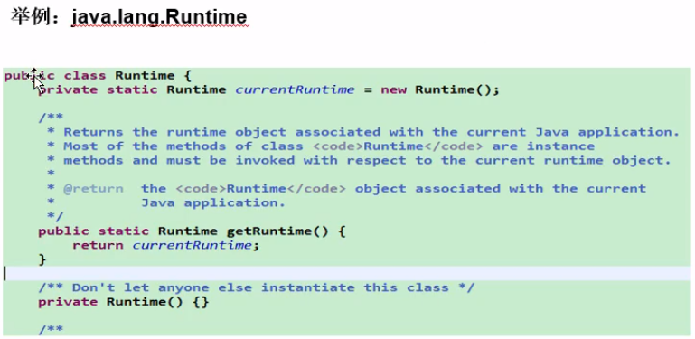
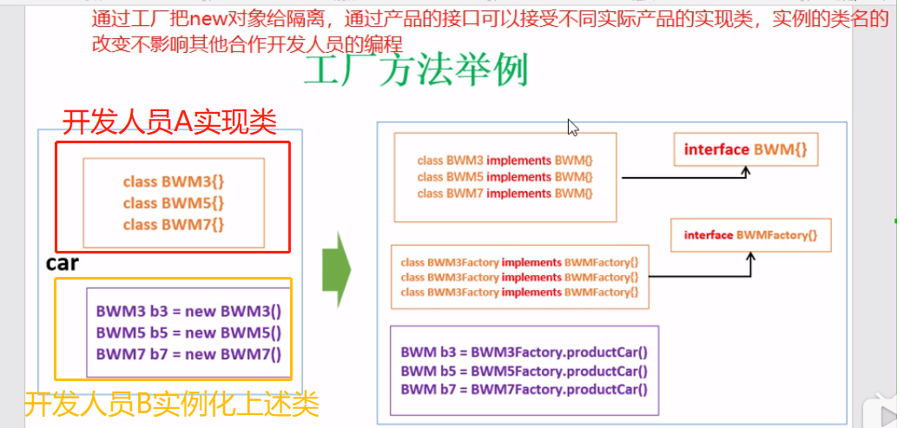

- [设计模式](#%e8%ae%be%e8%ae%a1%e6%a8%a1%e5%bc%8f)
  - [1. 单例模式](#1-%e5%8d%95%e4%be%8b%e6%a8%a1%e5%bc%8f)
    - [饿汉式](#%e9%a5%bf%e6%b1%89%e5%bc%8f)
    - [懒汉式](#%e6%87%92%e6%b1%89%e5%bc%8f)
  - [2. 模板方法设计模式](#2-%e6%a8%a1%e6%9d%bf%e6%96%b9%e6%b3%95%e8%ae%be%e8%ae%a1%e6%a8%a1%e5%bc%8f)
  - [3. 工厂模式](#3-%e5%b7%a5%e5%8e%82%e6%a8%a1%e5%bc%8f)


# 设计模式
## 1. 单例模式
- 有且仅有一个实例化对象
- 应用场景：
> 1. 实例化一个对象耗时
> 2. 整个代码运行中只需要一个对象

### 饿汉式
- 在类加载就创建一个对象

```java
public class Single
{
    // 构造函数私有化
    private Single(){}

    // 私有化一个static的实例
    private static Single s = new Single();

    // 共有化一个访问接口
    public Single getInstance()
    {
        return s;
    }
}
```

- 举例


### 懒汉式
- 当首次调用时才创建对象，后续都使用这个对象
- 存在线程安全问题

```java
public class Single
{
    // 构造函数私有化
    private Single(){}

    // 私有化一个static的实例
    private static Single s = null;

    // 共有化一个访问接口
    public Single getInstance()
    {
        if(s == null)
        {
          s = new Single();
        }
        return s;
    }
}
```

## 2. 模板方法设计模式
- 跟抽象类有关，父类中有一个方法的整体处理流程，但是在该方法中所涉及的另一些方法的实现跟子类相关，需要由子类重写
- 因为父类中给出了一个模板，子类中有模板中某些方法的具体实现
  
```java
// 模板类
public abstract class TemplateMethod
{
    public abstract void deal(); // 由子类实现
    public final void run() // 子类继承但不允许重写
    {
        ...
        deal();
        ...
    }
}

// 继承模板类的子类
public class Method extends TemplateMethod
{
    public void deal() // 子类具体实现处理方法
    {
        ...
    }
}
```

> c++中：
> - 声明了纯虚函数的类都是抽象类
> - virtual和final都只允许在类内声明时使用，类外实现不能加
> - [C++(继承):09---虚函数、重写(覆盖)、动态绑定(关键字virtual、override、final)](https://blog.csdn.net/qq_41453285/article/details/92715943)
> 
> ```c++
> // 模板方法
> class TemplateMethod
> {
>     virtual void deal() = 0; // 纯虚函数，由子类实现
>     void run() // 子类继承但不允许重写
>     {
>       ...
>        deal();
>        ...
>     }
> };
> 
> // 子类
> class Method : public TemplateMethod
> {
>     virtual void deal() override // 子类具体实现处理方法
>     {
>         ...
>     }
> };
> ```

## 3. 工厂模式
- 工厂模式是在将创建类对象的操作放入子类中进行，解决紧耦合问题
> 
> 上图中开发人员B需要使用开发人员A实现的类，如果在B中直接实例化A中类的对象，则一旦A中类名发生变化，会直接影响B中类对象的使用。<br>
> 为解决上述问题，在A中创建一个工厂，在工厂中实现类对象的创建，B通过调用工厂的对象创建方法即可实例化类对象，这样如果A中类名发生变化，只需要在A中的工厂中作相应修改，与B无关，达到解耦的目的。

```java
// A人员
// 类文件
public interface BWM
{
    void showInfo();
}

// 子类BWM3
class BWM3 implements BWM
{
    public void showInfo()
    {
        ...
    }
}

// 子类BWM5
class BWM5 implements BWM
{
    public void showInfo()
    {
        ...
    }
}

// 子类BWM7
class BWM7 implements BWM
{
    public void showInfo()
    {
        ...
    }
}
```

```java
// A人员
// 工厂文件
public interface BWMFactory
{
    BWM product();
}

// 子类BWM3Factory
class BWM3Factory implements BWMFactory
{
    BWM product()
    {
        ...
        return new BWM3();
    }
}

// 子类BWM5Factory
class BWM5Factory implements BWMFactory
{
    BWM product()
    {
        ...
        return new BWM5();
    }
}

// 子类BWM5Factory
class BWM7Factory implements BWMFactory
{
    BWM product()
    {
        ...
        return new BWM7();
    }
}
```

```java
// B人员
// 使用BWM类对象
BWM b3 = new BWM3Factory().product();
BWM b5 = new BWM5Factory().product();
BWM b7 = new BWM7Factory().product();
```

